# BrAIn — Interface Overview

BrAIn runs as a local web app (`brain --mode http --root <project> --port 4173`, or the `Start BrAIn.bat` / `start-brain.sh` launcher) — or as the desktop app described first below, which is a wizard in front of that same server. Opening `http://localhost:4173` shows a two-pane shell: a 280px sidebar on the left and a main content panel on the right, both rendered as dark "glass" surfaces (near-black, blurred, hairline accent-colored border) floating over a slowly drifting ambient background. Below 860px width the sidebar collapses into a slide-in drawer opened with a hamburger button.

## Desktop app

No terminal at all: pick a folder with a native picker, choose dev/notes and which AI assistant, and BrAIn is set up and running in its own window. "Open Existing Projects" lists everything set up before — each row shows its profile and AI assistant, both changeable in place (dev/notes recolors the row's border to match; switching AI writes that assistant's config/instructions file alongside whatever's already there, it doesn't delete the previous one), plus Open/Remove. Several projects can be open at once, each in its own window on its own port.

| Welcome | Your Projects |
|---|---|
| 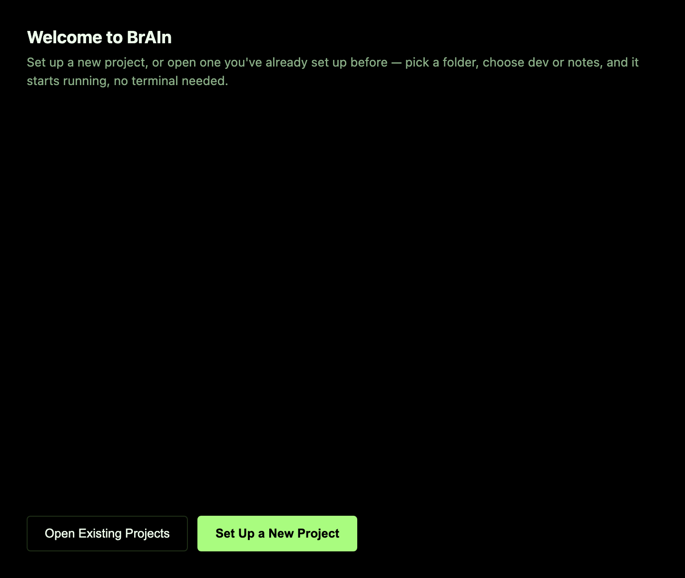 | 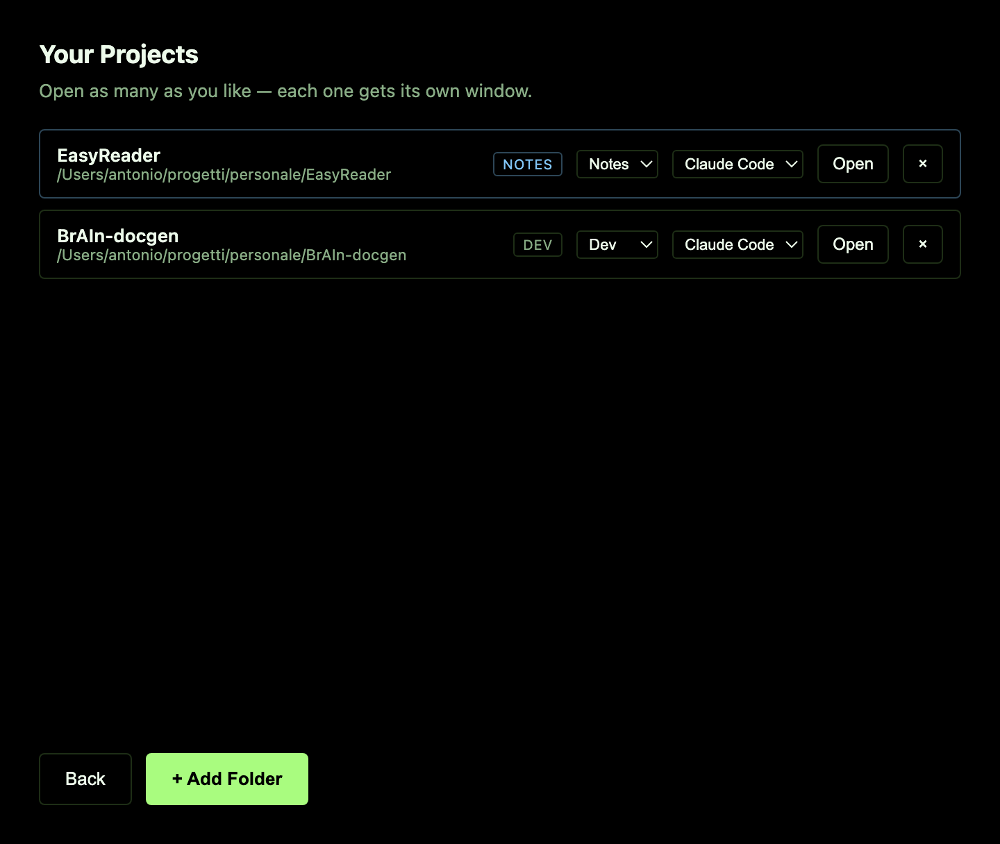 |

| Choose folder | Dev/notes + AI assistant | Done |
|---|---|---|
| 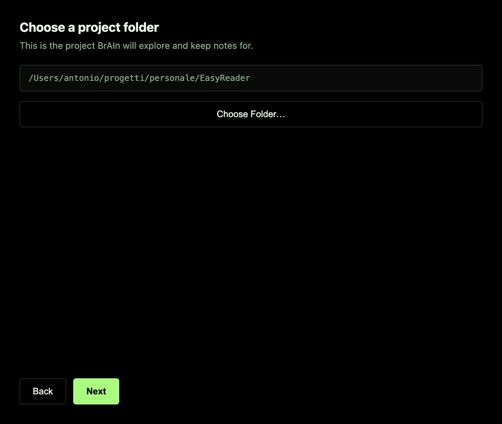 | 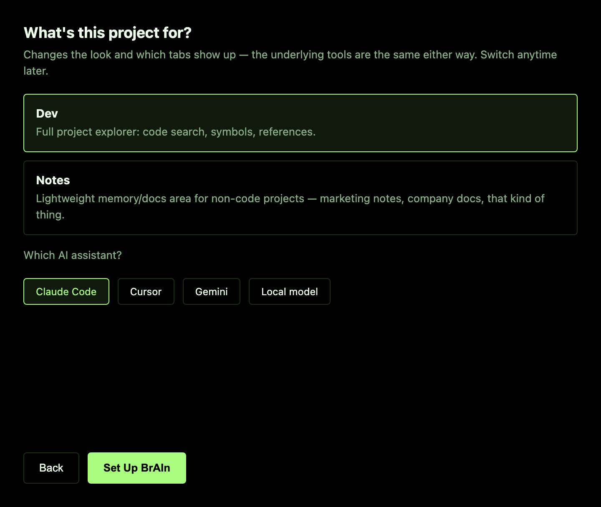 | 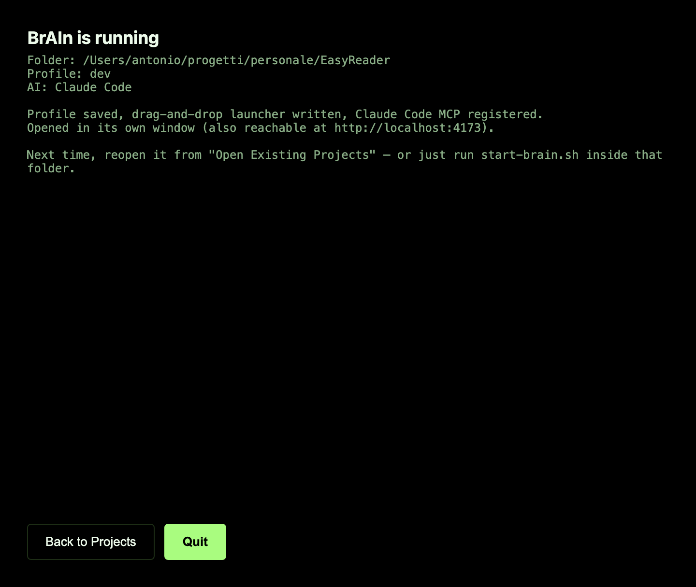 |

See [`desktop/README.md`](desktop/README.md) for how to build/run it and how each step maps to the concepts below.

The sidebar holds seven tabs. Selecting one swaps the main panel's content; the active tab is filled with the accent color.

The search bar above the content panel is context-aware: on Files/Graph/Index/MCP it searches code (`search_code`), on Docs/Memory/Style Guide it searches documentation content (`search_docs`) instead. Either way, results are clickable — a code hit opens that file for editing, a doc hit opens that doc.

## Profiles: dev vs notes

Every screenshot below is the **dev** profile (green/azure, the brain-mark icon, seven tabs, opens on Files) — the default, and what you get pointing BrAIn at an actual codebase. Point it at a non-code project instead (marketing notes, company docs) and the **notes** profile swaps the accent to blue/violet, recolors the same brain mark, opens on Docs instead of Files, and drops the Index/MCP tabs (dev-debugging views, not useful on a non-code project — switch back to `dev` and they're there). The underlying tools are identical either way. The header (and the browser tab title) always reads **"‹Dev or Notes› - ‹project name›"**, so several BrAIn tabs open at once stay easy to tell apart.

| dev | notes |
|---|---|
| 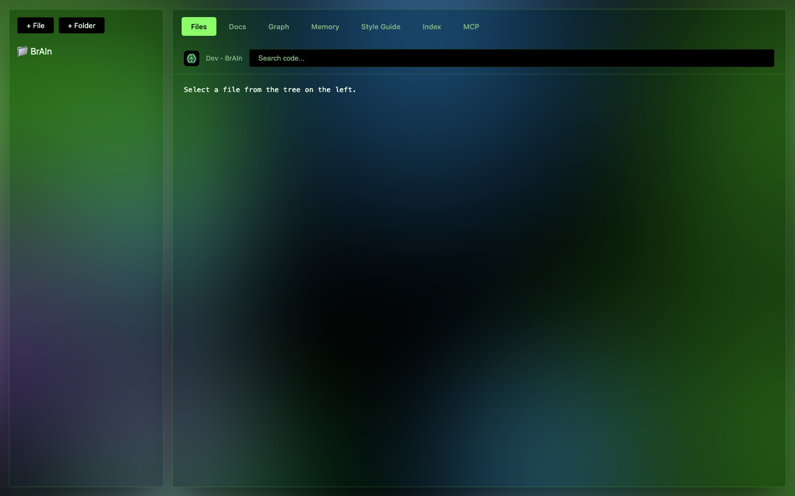 | 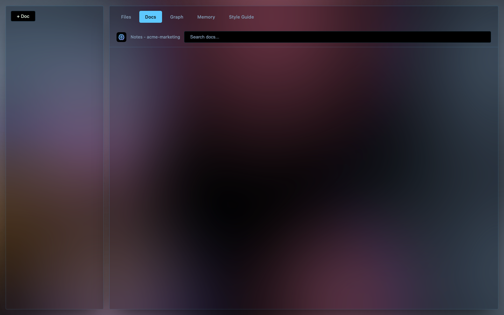 |

Which profile a project uses is asked once, at `brain --init`, and stored per-project (`.brain/profile.json`) — see the main README for how to change it later.

## Files

Shows the project's real file tree. You can browse folders, open a file to view or edit its contents, create new files/folders, and rename or delete existing ones — all directly from the tree, with changes written straight to disk.

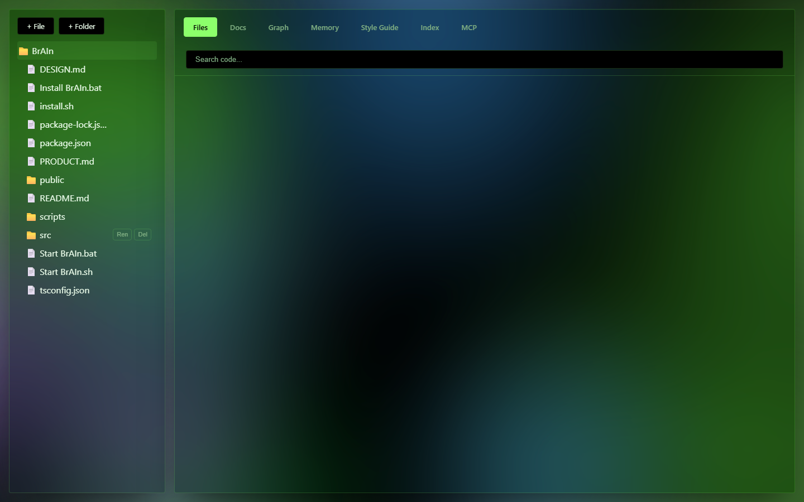

## Docs

Lists the documentation pages the AI has written for the project. Clicking one opens it for reading or editing. Docs can link to each other with `[[wikilink]]` syntax, which is what powers the Graph tab. Shown here on a project with no docs written yet.

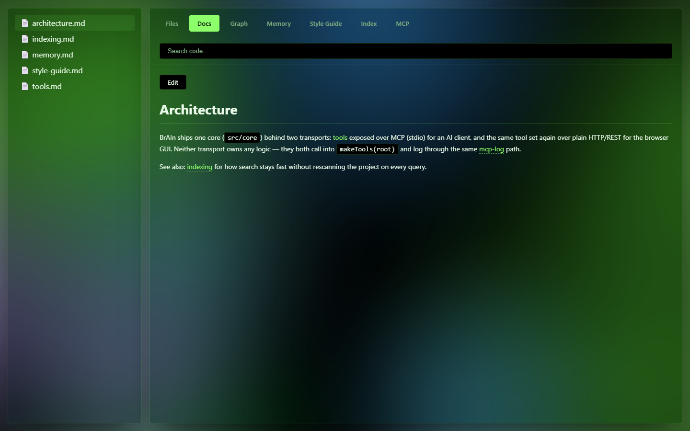

## Graph

Renders the same docs as a network: each doc is a small glowing sphere node (canvas-drawn), each `[[wikilink]]` between two docs becomes a line between their nodes. Nodes can be dragged around; clicking one opens that doc.

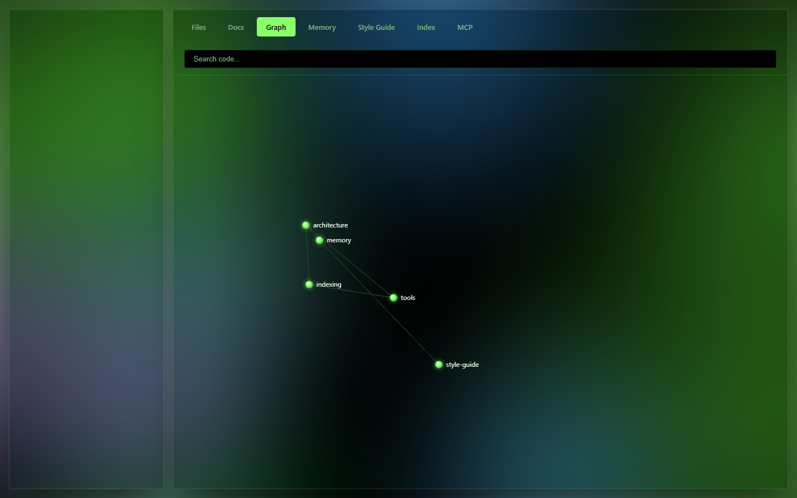

## Memory

Shows the persistent memory page — free-form notes the AI is instructed to check before starting work on the project. Editable like any other page.

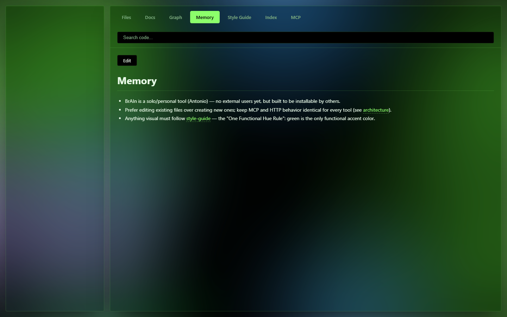

## Style Guide

Shows the design rules (colors, spacing, components) the AI is told to follow for anything visual, e.g. `DESIGN.md`.

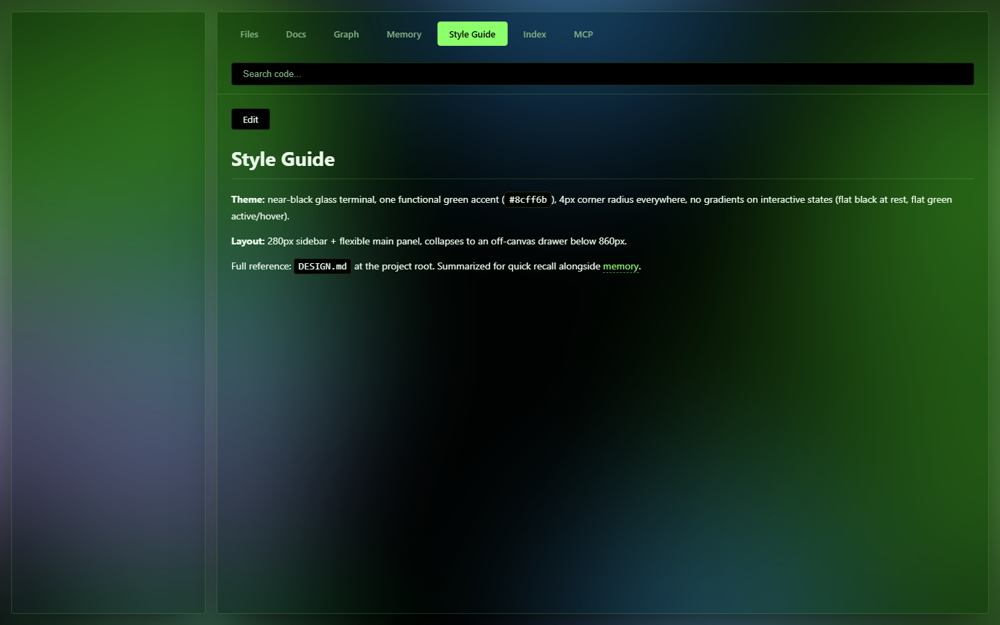

## Index

A table of what the search index actually contains: every indexed file, its line count, and when it was last updated — useful for confirming a recent change was picked up. Click a row to open that file for editing.

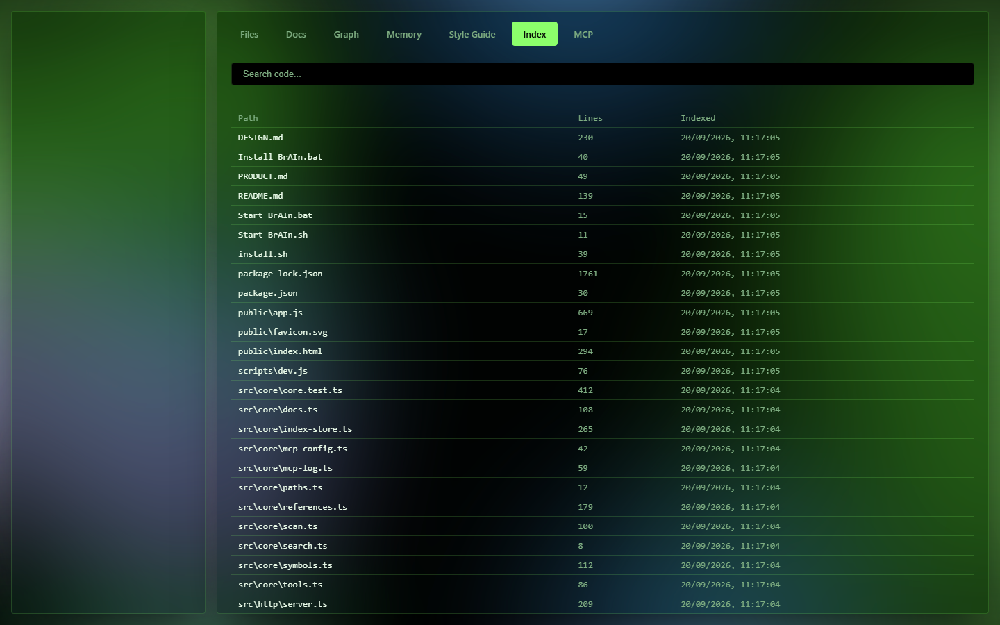

## MCP

A live log of every tool call an AI has made against this project through MCP: which tool, with what arguments, whether it succeeded, and how long it took. Status is shown as plain text ("ok" / "error"), not color — BrAIn's interface reserves color exclusively for its accent (green for dev, blue/violet for notes — see "Profiles" above).

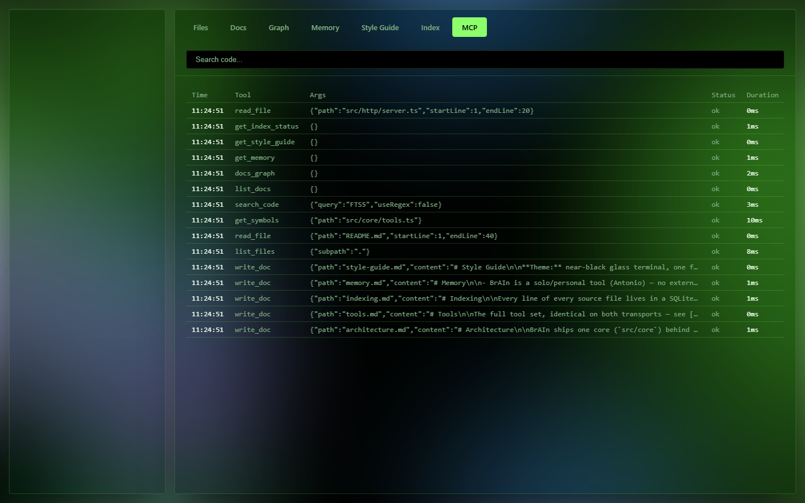
